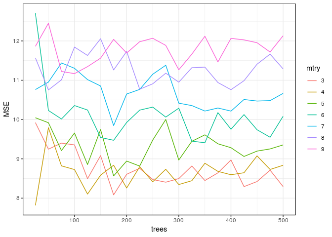
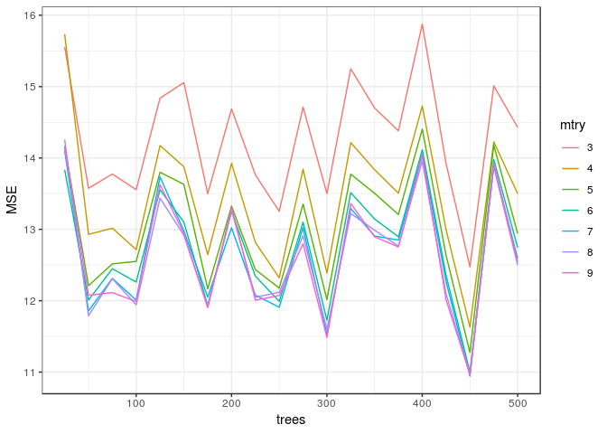
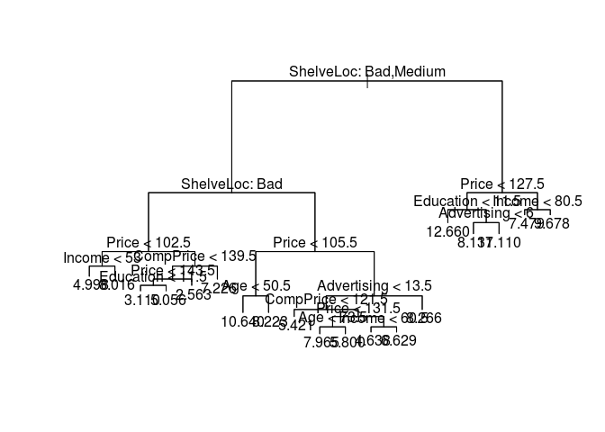
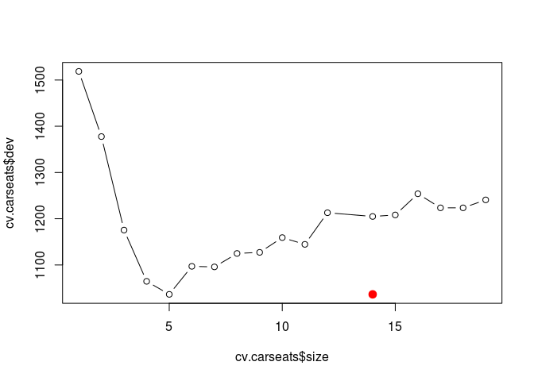
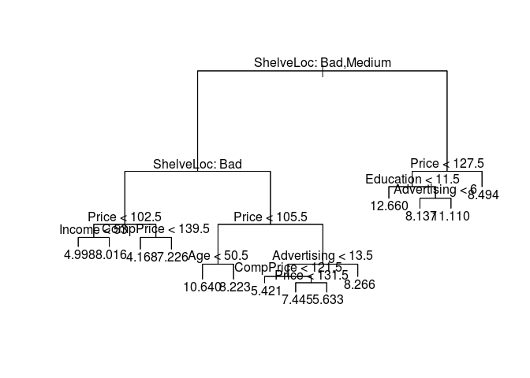
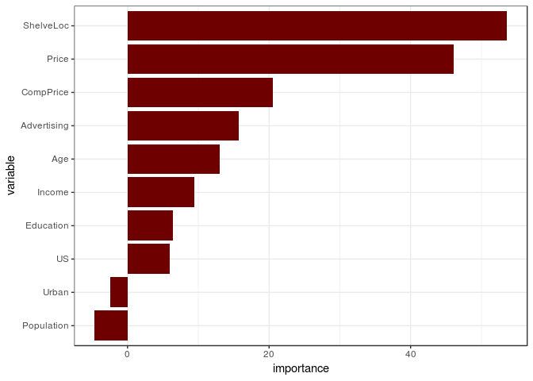
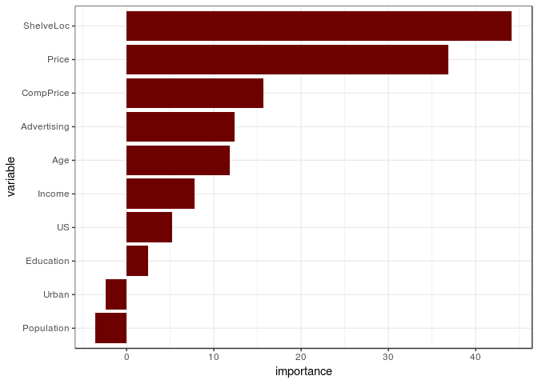

Homework 4: Bags, Forests, Boosts, oh my
================
Yi Liu
3/7/2019

Problem 1
---------

Problem 7 from Chapter 8 in the text. To be specific, please use a sequence of `ntree` from 25 to 500 in steps of 25 and `mtry` from 3 to 9 for by 1.

Answer 1
--------

#### Answer 1 w/o cross-validation

``` r
#without cross validation
set.seed(1)
df <- tbl_df(Boston)
inTraining <- createDataPartition(df$medv, p = .75, list = F)
training <- df[inTraining, ]
testing  <- df[-inTraining, ]
results <- tibble(trees = rep(seq(25,500,by=25), each=7),
                  mtry = rep(3:9, each=1,times=20),
                  MSE = rep(NA, length(trees)))
for (i in seq(25, 500,by=25)){
  for (j in seq(3, 9, by=1)){
    rf_results <- randomForest(medv ~ ., data = training, ntree = i, mtry=j)
    test_pred <- predict(rf_results, newdata = testing)
    error <- (mean((test_pred - testing$medv)^2))
    results[which(results$trees==i & results$mtry==j),'MSE'] = error
  }
}
p <- ggplot(data = results, aes(x = trees, y = MSE, group=mtry, col=as.factor(mtry)))
p + geom_line() + labs(color = 'mtry')
```



``` r
set.seed(1)
results <- tibble(trees = rep(seq(25,500,by=25), each=7),
                  mtry = rep(3:9, each=1,times=20),
                  MSE = rep(NA, length(trees)))
set.seed(1)
for (i in seq(25, 500, by=25)){
  rf_results <- train(medv ~ ., 
                      data = training,
                      method = "rf",
                      ntree = i,
                      importance = T,
                      tuneGrid = data.frame(mtry = seq(3,9,by=1)))
  for (k in seq(1,7)){
    results[which(results$trees==i & results$mtry==k+2),'MSE'] = (rf_results$results$RMSE[k])^2
    }
}
p <- ggplot(data = results, aes(x = trees, y = MSE, group=mtry, col=as.factor(mtry)))
p + geom_line() + labs(color = 'mtry')
```



RMSE fluctuates inconsistently based on the number of trees - 50 looks like a good compromise between time to run and low error. In terms of mtry, RMSE improvement appears to stop at around 5 so that seems like a good option.

Problem 2
---------

Problem 8 from Chapter 8 in the text. Set your seed with 9823 and split into train/test using 50% of your data in each split. In addition to parts (a) - (e), do the following:

Answer 2
--------

### (a) Split the data set into a training set and a test set.

``` r
df <- tbl_df(Carseats)
set.seed(9823)
inTraining <- createDataPartition(df$Sales, p = .5, list = F)
training <- df[inTraining, ]
testing  <- df[-inTraining, ]
```

### (b) Fit a regression tree to the training set. Plot the tree, and interpret the results. What test MSE do you obtain?

``` r
tree_carseats <- rpart(Sales ~ . , training)
prp(tree_carseats)
```



``` r
test_pred <- predict(tree_carseats, newdata = testing)
mean((test_pred - testing$Sales)^2)
```

    ## [1] 4.484515

### (c) Use cross-validation in order to determine the optimal level of

tree complexity. Does pruning the tree improve the test MSE?

``` r
set.seed(9823)
fit_control <- trainControl(method = "repeatedcv", number = 10, repeats = 10)
cv_carseats_tree <- train(Sales ~ ., training, 
                          method = "rpart2", 
                          trControl = fit_control, 
                          tuneGrid = data.frame(maxdepth = 1:10))
```

    ## Warning in nominalTrainWorkflow(x = x, y = y, wts = weights, info =
    ## trainInfo, : There were missing values in resampled performance measures.

``` r
plot(cv_carseats_tree)
```



Maxdepth of 3 gives the lowest RMSE, we will re-fit using that

``` r
set.seed(9823)
cv_carseats_tree3 <- rpart(Sales ~ ., training, maxdepth = 3)
prp(cv_carseats_tree3)
```



``` r
test_pred <- predict(cv_carseats_tree3, newdata = testing)
mean((test_pred - testing$Sales)^2)
```

    ## [1] 4.933184

### (d) Use the bagging approach in order to analyze this data. What test MSE do you obtain? Use the importance() function to determine which variables are most important.

``` r
set.seed(9823)
carseats_bag <- randomForest(Sales ~ ., data = training, 
                             mtry = ncol(training)-1,
                             ntrees=500,
                             importance=TRUE)
test_pred <- predict(carseats_bag, newdata = testing)
mean((test_pred - testing$Sales)^2)
```

    ## [1] 3.01177

``` r
imp <- varImp(carseats_bag)
rn <- row.names(imp)
imp_df <- tibble(variable = rn, importance = imp$Overall) %>%
  arrange(desc(-importance)) %>%
  mutate(variable = factor(variable, variable))
p <- ggplot(data = imp_df, aes(variable, importance))
p + geom_col(fill = "#6e0000") +
  coord_flip()
```



Shelf location and price are the two most important variables here

### (e) Use random forests to analyze this data. What test MSE do you obtain? Use the importance() function to determine which variables ar emost important. Describe the effect of m, the number of variables considered at each split, on the error rate obtained.

``` r
set.seed(9823)
carseats_rf <- train(Sales ~ ., data = training,
                     method = "rf", ntree = 250,
                      importance = T, tuneGrid = data.frame(mtry = 2:10))
p <- ggplot(data = carseats_rf$results, aes(x = mtry, y = RMSE))
p + geom_point() +
  geom_line()
```


mtry of 5-8 results in similiar RMSE, we will use 5 for simplicity

``` r
set.seed(9823)
carseats_rf5 <- randomForest(Sales ~ ., data = training, mtry = 5, importance = TRUE)
test_pred <- predict(carseats_rf5, newdata = testing)
mean((test_pred - testing$Sales)^2)
```

    ## [1] 3.12534

``` r
imp <- varImp(carseats_rf5)
rn <- row.names(imp)
imp_df <- tibble(variable = rn, importance = imp$Overall) %>%
  arrange(desc(-importance)) %>%
  mutate(variable = factor(variable, variable))
p <- ggplot(data = imp_df, aes(variable, importance))
p + geom_col(fill = "#6e0000") +
  coord_flip()
```



Again, shelf location and price are most important

### 1. Fit a gradient-boosted tree to the training data and report the estimated test MSE.

``` r
set.seed(9823)
grid <- expand.grid(interaction.depth = c(1, 3), 
                    n.trees = seq(0, 2000, by = 100),
                    shrinkage = c(.01, 0.001),
                    n.minobsinnode = 10)
trainControl <- trainControl(method = "cv", number = 5)
carseats_gb <- train(Sales ~ ., 
                     data = training,
                     distribution = "gaussian", 
                     method = "gbm",
                     trControl = trainControl, 
                     tuneGrid = grid,
                     verbose = FALSE)
```

    ## Warning in nominalTrainWorkflow(x = x, y = y, wts = weights, info =
    ## trainInfo, : There were missing values in resampled performance measures.

``` r
test_pred <- predict(carseats_gb, newdata = testing)
mean((test_pred - testing$Sales)^2)
```

    ## [1] 1.816239

### 2. Fit a multiple regression model to the training data and report the estimated test MSE.

``` r
carseats_lm <- lm(Sales ~ .,data = training)
test_pred <- predict(carseats_lm, newdata = testing)
mean((test_pred - testing$Sales)^2)
```

    ## [1] 1.012709

### 3. Summarize your results.

Tree error MSE steadily improved throughout the problem, with the original tree & cross-validation of depth around 4.5-5. Bagging and random forest dropped MSE to around 3, then boosting dropped to 1.8. However, a multiple regression with all variables was best at 1.01 and the easiest to explain.
